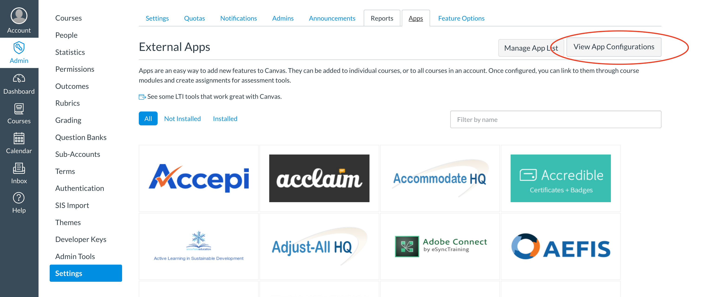
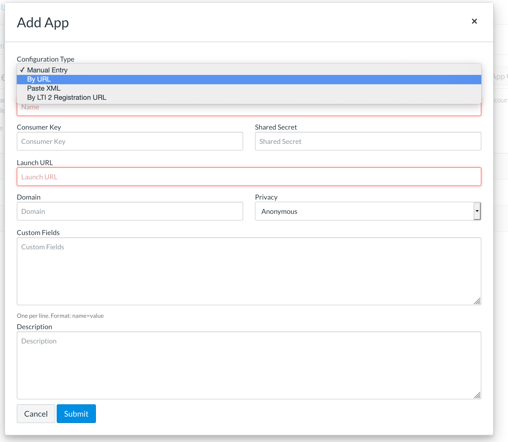
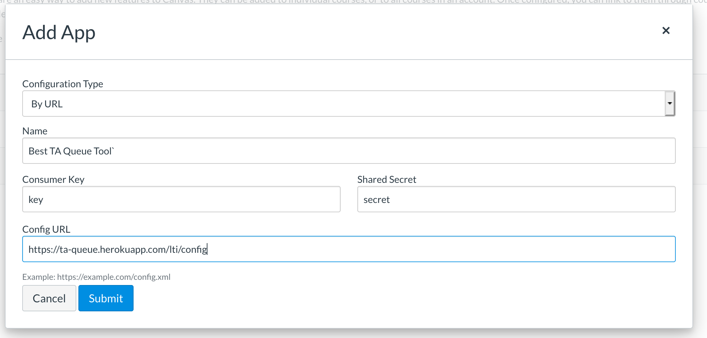

# TA Queue

TA Queue is an LTI tool that facilitates students receiving help from their TAs.
Students can request help, which adds them to a queue.
TAs can sign in to keep track of their help hours, review the queue of waiting students, and monitor stats of how they use their time.

## Live Website

If you would like to see the live version of this app, check out [https://ta-queue.herokuapp.com/](https://ta-queue.herokuapp.com/)

## LTI Tool Use

TA Queue is designed to be used with Canvas as an LTI tool.
When used through Canvas, TA Queue can determine user roles and course information.
With this integration, users do not have to register through TA Queue to use it, but can use their Canvas log in.

## Integrating with Canvas

1. Go to a Canvas account that you have admin privileges for
2. Go to "Admin" in the sidebar, navigate to "Settings", and then "Apps". Click the "View App Configuration" button.

3. Click "+ App" button. In the modal, change "Configuration Type" to "By Url".
Note that if you are testing the app locally, you will need to use the "Paste XML" option, and use the url to your local app.

4. Fill in the form. Make sure that "Consumer Key" and "Shared Secret" match your provided key and secret.
"Config URL" should be [https://ta-queue.herokuapp.com/lti/config](https://ta-queue.herokuapp.com/lti/config)

5. Go to a Course as an Admin. This course should have a module.
6. Add an item to a course module.
Set the type to "External Tool," and from the list of tools provided, select the LTI Tool you created in step 4.
All the fields should be filled in correctly, so you should just have to press "Add Item".

7. Now, just press the name of the module you just added, and voila! The TA Queue should be embedded in Canvas.
8. Try masquerading as a student, and as a TA.
The TA Queue will detect if you are entering as a student or a TA, and will alter the page served accordingly.

## Collaborators

### Instructure Hackweek 2018

Sara Chadwick.

Created the basic features and design, including students being able to request help, and TAs able to see students who needed help and select which student to help.

### Instructure Hackweek 2019

Sara Chadwick as lead.

Aros Aziz, Kai Bjorkman, Kristi Bresciano, Avram Twitchell.

*Sara Chadwick* --> Lead, Dashboard UI

*Aros Aziz* --> TA Queue Feature

*Kai Bjorkman* --> Time Clock Metrics and UI

*Kristi Bresciano* --> Time Clock Metrics and UI

*Avram Twitchell* --> LTI Integration
